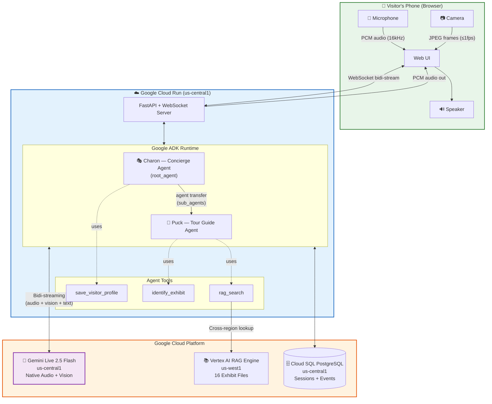
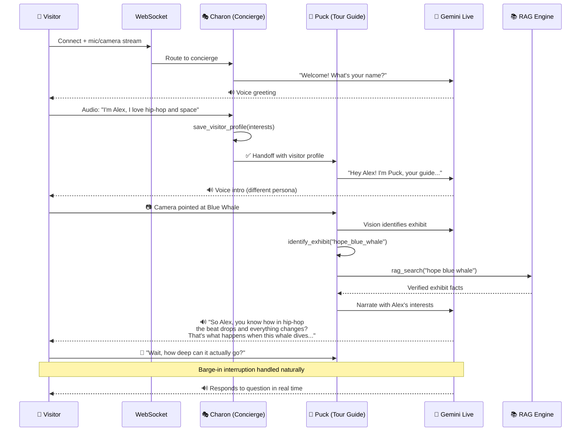

# 🏛️ My Pocket Guide

> **A real-time, voice-and-vision AI tour guide that sees what you see, knows what you love, and tells you a story you'll actually remember.**


**Category:** Live Agents 🗣️ · Built for the [Gemini Live Agent Challenge](https://geminiliveagentchallenge.devpost.com/) · `#GeminiLiveAgentChallenge`

---

## 📹 Demo Video

> **[🎬 Watch the demo →](https://PLACEHOLDER_VIDEO_LINK)**
>
> _4-minute walkthrough showing the live agent in action. Real multimodal interaction, no mockups._

---

## 🧩 The Problem

My Pocket Guide solves two problems, from two perspectives.

### For Museums: Engagement is falling and they're flying blind

Museums are facing a quiet crisis. Speaking with people across the industry, the same challenge keeps coming up: **keeping visitors engaged and getting them to come back**. The core issue isn't the collections. It's that museums have almost no way to understand what individual visitors actually care about. Every person gets the same placard, the same audio guide, the same one-size-fits-all experience. There's no feedback loop and no data on what actually resonated. Museums want to make their visitors feel something personal, but they don't have the tools to do it at scale, and they can't justify rebuilding their entire visitor experience from the ground up.

### For Visitors: The experience doesn't meet them where they are

On the other side, visitors are quietly disengaging. A ten-year-old gamer and a marine biologist walk past the same exhibit and read the same paragraph. Neither feels like the museum was made for them. The information is there, but it's locked behind dense placards written for an academic audience, or generic audio guides that drone through the same script for everyone. For many visitors, especially younger ones, the gap between what they care about and how the exhibit is presented is just too wide. The curiosity is there. The way in isn't. And for visitors who don't speak the language fluently, or who feel intimidated by the formality of a museum setting, that barrier is even higher. People drift through rooms, glance at things, and leave without a story to tell anyone.

## 💡 The Solution

My Pocket Guide gives museums an AI-powered personal tour guide that works with their **existing collection**, with no new hardware, no exhibit redesign, and no app download. Visitors open a web page on their phone, have a short voice conversation about who they are and what they're into, then point their camera at any exhibit and get a live, spoken narration that connects that exhibit to *their* world.

**For the visitor**, it actually works the way you'd want it to. A visitor who loves football hears about the aerodynamics of a blue whale's dive compared to a striker's run. A geology student hears about the mineral composition of the Willamette Meteorite. Someone who's never been to a museum before gets a guide that speaks naturally, invites questions, and makes the unfamiliar feel personal. Same exhibit, completely different story, delivered in real time by voice, not text. No reading required, no prior knowledge assumed.

**For the museum**, visitors get a more engaging experience using the collection they already have. Beyond the hackathon build, the architecture is designed so museums can start understanding their visitors for the first time: which exhibits got the most interaction, how many questions people asked, whether they saved photos. That data feeds back to curators and gives them something they've never had to inform programming and exhibit design.

---

## ✨ Key Features

**Beyond the text box, this is what makes it a Live Agent:**

- **Dual-persona multi-agent system**: Charon (the concierge) collects your profile through natural conversation, then hands off to Puck (the tour guide) with a different voice and personality. Two distinct agents, smooth handoff.
- **Native multimodal vision**: Point your phone camera at any exhibit. The agent sees it in real time via Gemini's built-in vision capabilities, no separate image classification API, no upload button. Camera frames stream at up to 1fps via `send_realtime()`.
- **Barge-in and interruption**: This isn't turn-based. Interrupt the guide mid-sentence, ask a follow-up, change the subject. The Gemini Live API handles natural conversation flow with speech-to-speech.
- **RAG-grounded knowledge**: Every exhibit narration is backed by a Vertex AI RAG corpus containing verified facts about all 16 exhibits. The agent doesn't hallucinate exhibit history, it retrieves it.
- **Personalised lateral connections**: The concierge captures *specific* interests (not "I like science", more like "I play bass guitar and I'm obsessed with Formula 1"). The tour guide uses these to build surprising, memorable connections between you and each exhibit.
- **Persistent sessions**: Cloud SQL PostgreSQL stores session state via ADK's `DatabaseSessionService`, so your profile and conversation history survive reconnections.
- **Context window compression**: `ContextWindowCompressionConfig` summarises old context instead of hard-capping, enabling unlimited session duration. This matters for a full museum visit.

---

## 🏗️ Architecture



### Agent Flow



---

## 🧰 Tech Stack

| Component | Technology | Purpose |
|-----------|-----------|---------|
| AI Agents | Google ADK (Agent Development Kit) | Multi-agent orchestration with handoff |
| LLM / Audio | Gemini Live 2.5 Flash (`gemini-live-2.5-flash-native-audio`) | Real-time speech-to-speech with native audio |
| Vision | Gemini native multimodal | Camera frame processing via `send_realtime(Blob)` |
| Knowledge Base | Vertex AI RAG Engine | Grounded exhibit fact retrieval (16 exhibits) |
| Backend | FastAPI + WebSocket | Bidirectional streaming server |
| Session Storage | Cloud SQL PostgreSQL | ADK `DatabaseSessionService` for persistence |
| Deployment | Google Cloud Run (`us-central1`) | Serverless container hosting |
| CI/CD | GitHub Actions | Automated deployment on push to `main` |
| Audio Playback | Web Audio API + AudioWorklet | Low-latency PCM audio rendering |
| Bot Protection | reCAPTCHA v3 | Prevents abuse of the public endpoint |

---

## 🔑 Google Cloud Services Used

| Service | How It's Used |
|---------|--------------|
| **Cloud Run** | Hosts the FastAPI backend and serves the static frontend. Configured with `--timeout=3600` to support long-lived WebSocket connections for full museum visits. |
| **Vertex AI, Gemini Live** | The bidi-streaming connection to `gemini-live-2.5-flash-native-audio` in `us-central1`. Handles simultaneous audio input, audio output, vision input, and text in a single persistent stream. |
| **Vertex AI, RAG Engine** | Corpus of 16 exhibit markdown files in `us-west1`. Each exhibit file contains verified facts, scientific significance, history, and visual identification keywords. One-off lookups per exhibit, so cross-region latency is acceptable. |
| **Cloud SQL (PostgreSQL)** | Stores ADK sessions and events via `DatabaseSessionService`. Enables session resumption and persistent visitor profiles across reconnections. |
| **Artifact Registry** | Container image storage via `gcloud run deploy --source` (automatic Buildpacks). |

---

## 🖼️ Galleries & Exhibits

Five themed galleries with 16 canonical exhibits:

| Gallery | Theme | Exhibits |
|---------|-------|----------|
| 🦕 Echoes of the Deep | Prehistoric Earth | Hope the Blue Whale · Dippy the Diplodocus · The Coelacanth |
| 🏛️ Marble & Myth | Ancient Greece | Caryatid of the Erechtheion · The Parthenon Frieze · The Antikythera Mechanism |
| 🚀 Beyond the Horizon | Space & Cosmos | The Willamette Meteorite · Apollo 11 Command Module · Hubble Space Telescope Replica |
| 🦑 Abyss | Ocean | The Giant Squid Specimen · Megalodon Jaw Reconstruction · HMS Challenger Collection |
| 🎨 Brushstrokes of Time | Art Through the Ages | The Mona Lisa · Trevi Fountain (Panini) · Andy Warhol's Marilyn Monroe · Really Good (Shrigley) |

---

## 🗂️ Repository Structure

```
my-pocket-guide/
├── backend/
│   ├── main.py                  # FastAPI app, WebSocket handler, ADK runner
│   ├── agent.py                 # Root agent (concierge with sub_agents)
│   └── agents/
│       ├── concierge_agent.py   # Charon, profile collection + handoff
│       └── tour_guide_agent.py  # Puck, vision + RAG narration
│   └── tools/
│       ├── identify_tool.py     # Exhibit identification + state sync
│       ├── rag_tool.py          # Vertex AI RAG search
│       └── profile_tool.py      # Save visitor profile to session state
├── frontend/
│   ├── index.html               # Single-page app
│   └── js/
│       ├── audio-player.js      # AudioWorklet for PCM playback
│       └── pcm-player-processor.js
├── data/
│   └── exhibits/                # 16 exhibit markdown files (RAG source)
├── scripts/
│   ├── ingest.py                # RAG corpus ingestion
│   ├── dedup_rag.py             # Remove duplicate RAG files
│   └── add_visual_ids.py        # Patch exhibit files with visual keywords
├── tests/
│   └── test_rag.py              # RAG integration tests
├── .github/
│   └── workflows/
│       └── deploy.yml           # CI/CD, auto-deploy on push to main
├── Dockerfile
├── deploy.sh                    # Cloud Run deployment script
├── .env.example                 # Environment variable template
└── requirements.txt
```

---

## 🚀 Spin-Up Instructions

### Prerequisites

- Python 3.12+
- Google Cloud project with billing enabled
- `gcloud` CLI authenticated (`gcloud auth login`)
- APIs enabled: Cloud Run, Cloud SQL Admin, Vertex AI, Secret Manager

### 1. Clone & install

```bash
git clone https://github.com/cass-p-papa/my-pocket-guide.git
cd my-pocket-guide
python -m venv venv312 && source venv312/bin/activate
pip install -r requirements.txt
```

### 2. Configure environment

```bash
cp .env.example .env
# Edit .env with your values, see comments in the file
```

### 3. Set up Cloud SQL

```bash
# Create instance (if not already exists)
gcloud sql instances create museum-db \
  --database-version=POSTGRES_15 \
  --tier=db-f1-micro \
  --region=us-central1

# Create database and user
gcloud sql databases create museum_sessions --instance=museum-db
gcloud sql users create museum_user --instance=museum-db --password=YOUR_PASSWORD
```

### 4. Ingest exhibit data into Vertex AI RAG

```bash
# First run: creates corpus and ingests all 16 exhibit files
python3 scripts/ingest.py

# Copy the RAG_CORPUS value printed at the end into your .env
```

### 5. Run locally

```bash
# Requires Cloud SQL proxy or a local PostgreSQL instance
# Set DATABASE_URL in .env to point to local DB

uvicorn backend.main:app --host 0.0.0.0 --port 8080 --reload
# Open http://localhost:8080
```

### 6. Deploy to Cloud Run

```bash
# Load your .env and deploy
source .env && ./deploy.sh
```

The script will print the service URL when complete.

---

## 🔄 Automated Deployment (CI/CD)

Deployment is automated via GitHub Actions. Pushing to `main` triggers `.github/workflows/deploy.yml`, which builds and deploys to Cloud Run automatically.

**Required GitHub Secrets:**

| Secret | Description |
|--------|-------------|
| `GCP_SA_KEY` | JSON key for a service account with Cloud Run Admin + Cloud SQL Client roles |
| `GCP_PROJECT` | Your Google Cloud project ID |
| `CLOUDSQL_INSTANCE` | `project:region:instance` |
| `DB_USER` / `DB_PASS` / `DB_NAME` | Database credentials |
| `RAG_CORPUS` | Full Vertex AI corpus resource name |
| `RECAPTCHA_SITE_KEY` / `RECAPTCHA_SECRET_KEY` | reCAPTCHA v3 keys |

---

## 🔬 Design Decisions & Architecture Notes

- **Region co-location for bidi-streaming**: Cloud Run and Cloud SQL are both in `us-central1` to co-locate with the Gemini Live endpoint. The continuous bidi-streaming connection is far more latency-sensitive than a one-off RAG lookup, so the RAG corpus stays in `us-west1` where it was created. Cross-region cost is acceptable for non-streaming calls.
- **Native vision over custom streaming tools**: Camera frames are sent as `send_realtime(Blob(mime_type="image/jpeg"))`. This uses the model's built-in multimodal capabilities instead of building a separate Type 2 streaming tool, which is incompatible with the Live API architecture.
- **Independent tools, not dependency chains**: `identify_exhibit` (state sync) and `rag_search` (knowledge retrieval) are intentionally independent. A failed identification never silently skips a RAG lookup. The agent can still search by what it sees.
- **Descriptive prompt philosophy**: The tour guide prompt describes the *quality and style* of personalised connections rather than giving examples, which would constrain the model's creative thinking.

---

## 📝 Findings & Learnings

**Intuitive Multimodal UX Requires Constant Feedback**

When I tested the app with other people, nobody could tell what was happening. Is the agent listening? Are camera frames being sent? Is silence thinking or a crash? I added a listening strip with a waveform, a "Streaming" pill over the camera, and an orb that shifts between idle, listening, and speaking states. In a live voice+vision interface, the UI's main job is answering one question: "is this thing on?"

**Browser Audio Constraints on Mobile**

Chrome on Android ignores the 16kHz sample rate you request when creating an AudioContext and quietly records at the device's native rate, usually 48kHz. Send that raw PCM to the Gemini Live API and you get garbled, pitch-shifted audio with no error to explain why. The fix: detect the actual `AudioContext.sampleRate` at runtime and downsample in the AudioWorklet before sending. This only shows up on real phones, not desktop emulators.

**Grounding Documents Need Visual Context, Not Just Facts**

My RAG corpus started with only historical and scientific content for each exhibit. Good for narration, useless for helping the agent figure out what it was looking at through the camera. I added `## Visual Identification` sections to every markdown file with keywords, common visitor names ("the big thumb", "the whale skeleton"), and physical descriptions like size, colour, and material. Exhibit recognition went from coin-flip to reliable.

---

## 🔗 Third-Party Integrations

This project uses the following third-party tools and services, all in accordance with their respective terms:

| Integration | Usage | License/Terms |
|-------------|-------|---------------|
| [Google ADK](https://google.github.io/adk-docs/) | Multi-agent framework | Apache 2.0 |
| [Gemini Live API](https://cloud.google.com/vertex-ai) | LLM, audio, and vision | Google Cloud ToS |
| [Vertex AI RAG](https://cloud.google.com/vertex-ai) | Knowledge retrieval | Google Cloud ToS |
| [Cloud SQL](https://cloud.google.com/sql) | Session persistence | Google Cloud ToS |
| [Cloud Run](https://cloud.google.com/run) | Container hosting | Google Cloud ToS |
| [FastAPI](https://fastapi.tiangolo.com/) | Backend web framework | MIT |
| [reCAPTCHA v3](https://developers.google.com/recaptcha) | Bot protection | Google ToS |

No third-party datasets or content were used. All 16 exhibit markdown files are original content created for this project.

---

## ☁️ Proof of Google Cloud Deployment

### [Try it live → museum-tour-guide-912042965719.us-central1.run.app](https://museum-tour-guide-912042965719.us-central1.run.app)

For a walkthrough of the Cloud Run service, Cloud SQL instance, and Vertex AI RAG corpus running in the Google Cloud Console, see the [deployment proof recording](https://github.com/casspapa/MyPocketGuide/blob/main/hackathon-submission-items/deployment-evidence.mp4).

Key files demonstrating Google Cloud integration:
- [`deploy.sh`](deploy.sh) - Cloud Run deployment with Cloud SQL integration
- [`backend/main.py`](backend/main.py) - Cloud SQL `DatabaseSessionService` for ADK session persistence
- [`backend/tools/rag_tool.py`](backend/tools/rag_tool.py) - Vertex AI RAG Engine API calls
- [`backend/tools/identify_tool.py`](backend/tools/identify_tool.py) - Exhibit identification with session state sync
- [`scripts/ingest.py`](scripts/ingest.py) - Vertex AI RAG corpus ingestion script
- [`.github/workflows/deploy.yml`](.github/workflows/deploy.yml) - Automated CI/CD to Cloud Run

---

## 🏆 Bonus Contributions

### Published Content (+0.6 pts max)

> _Coming soon._

### Automated Cloud Deployment (+0.2 pts)

Deployment is fully automated. Pushing to `main` triggers a GitHub Actions pipeline that builds and deploys to Cloud Run without manual intervention.
- [`deploy.sh`](deploy.sh) - Shell script for Cloud Run deployment with Cloud SQL connection
- [`.github/workflows/deploy.yml`](.github/workflows/deploy.yml) - GitHub Actions CI/CD pipeline

### Google Developer Group Membership (+0.2 pts)

> [g.dev/casspapadopoulos](https://g.dev/casspapadopoulos)

---

## 📄 License

This project was built for the [Gemini Live Agent Challenge](https://geminiliveagentchallenge.devpost.com/).

---

<p align="center">
  Built with 🎧 and ☕ by <a href="https://github.com/cass-p-papa">cass-p-papa</a>
</p>
